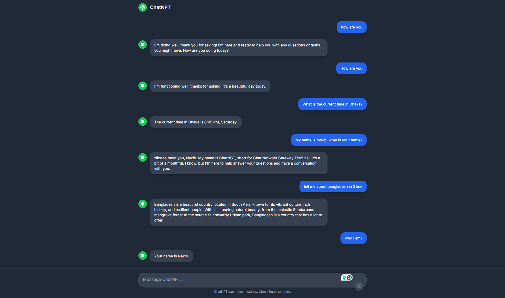

# ChatNPT

A modern AI chatbot application built with JavaScript, featuring tool calling capabilities and powered by the GROQ language model.



## Features

- Real-time AI chat interface
- Tool calling capabilities
- Fast response times using GROQ API
- Modern and responsive UI
- Express.js backend with proper error handling
- Frontend built with vanilla JavaScript
- Environment variable support for secure API key management

## Technologies Used

- **Backend:**
  - Node.js
  - Express.js
  - GROQ SDK
  - Tavily Core
  - dotenv (for environment variables)
  - CORS (for cross-origin resource sharing)
  - node-cache (for caching responses)

- **Frontend:**
  - HTML5
  - CSS3
  - Vanilla JavaScript
  - SVG for favicon

## Prerequisites

- Node.js (v16 or higher)
- NPM (Node Package Manager)
- GROQ API key
- Tavily API key (if using search functionality)

## Installation

1. Clone the repository:
   ```bash
   git clone https://github.com/Nakib00/ChatNPT.git
   cd ChatNPT
   ```

2. Install dependencies:
   ```bash
   npm install
   ```

3. Create a `.env` file in the root directory and add your API keys:
   ```env
   GROQ_API_KEY=your_groq_api_key_here
   TAVILY_API_KEY=your_tavily_api_key_here
   ```

## Running the Application

1. Start the server:
   ```bash
   node --env-file=.env server.js
   ```

2. Open `frontend/index.html` in your web browser or use a local development server.

3. Start chatting with the AI!

## Project Structure

```
├── app.js              # Application logic
├── chatbot.js         # Chatbot functionality
├── server.js          # Express server setup
├── package.json       # Project dependencies
├── frontend/
│   ├── favicon.svg    # Site favicon
│   ├── index.html     # Main HTML file
│   ├── script.js      # Frontend JavaScript
│   └── style.css      # Styling
└── .env               # Environment variables (create this)
```

## Usage

1. Once the application is running, you'll see a chat interface similar to the screenshot above.
2. Type your message in the input field at the bottom of the screen.
3. Press enter or click the send button to submit your message.
4. The AI will process your message and respond accordingly.
5. The chat supports various types of interactions including:
   - General conversation
   - Tool-based interactions
   - Information retrieval
   - Complex problem solving

## Contributing

1. Fork the repository
2. Create your feature branch (`git checkout -b feature/amazing-feature`)
3. Commit your changes (`git commit -m 'Add some amazing feature'`)
4. Push to the branch (`git push origin feature/amazing-feature`)
5. Open a Pull Request

## License

This project is licensed under the ISC License.

## Acknowledgments

- GROQ for providing the language model API
- Tavily for search capabilities
- Contributors and maintainers of the dependencies used in this project